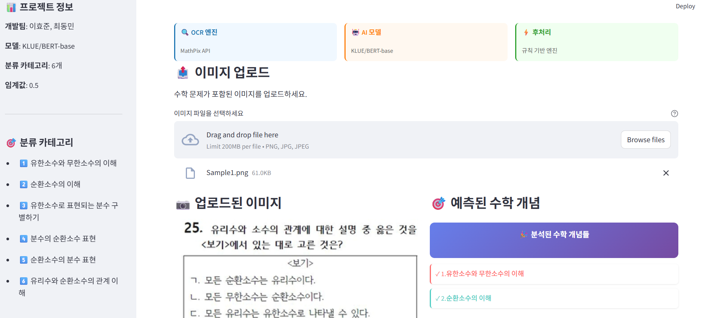

# 🏆 수학문제 인지요소 분류기

**2023 서울대학교 사범대학 AI융합교육 학생 연구 장기 프로젝트 동상 수상작**

AI 기반 수학 문제 이미지 분석 및 인지요소 자동 분류 시스템



## 📋 프로젝트 개요

본 프로젝트는 수학 문제 이미지를 업로드하면 해당 문제가 다루는 수학적 개념을 자동으로 분류해주는 AI 시스템입니다. 특히 **순환소수와 유한소수** 관련 개념들을 6가지 카테고리로 분류하여 교육적 활용이 가능합니다.

> 🎉 **수상 내역**: [2023 서울대학교 사범대학 AI융합교육 학생 연구 장기 프로젝트 동상](https://aiednet.kr/sub_posting/posting_view.php?number=317&dp1=competition)
> 📗 **보고서 및 발표 영상**: [2023 서울대학교 사범대학 AI융합교육 학생 연구 장기 프로젝트 결과](https://aiednet.kr/sub_posting/posting_view.php?number=309&dp1=competition)

### 🎯 주요 기능
- 📸 **이미지 업로드**: 수학 문제 이미지 업로드
- 🔍 **OCR 처리**: MathPix API를 통한 수학 수식 인식
- 🤖 **AI 분류**: KLUE/BERT 기반 다중 라벨 분류
- 📊 **결과 출력**: 해당하는 수학 개념들 자동 표시

### 📚 분류 카테고리
1. **유한소수와 무한소수의 이해**
2. **순환소수의 이해**
3. **유한소수로 표현되는 분수 구별하기**
4. **분수의 순환소수 표현**
5. **순환소수의 분수 표현**
6. **유리수와 순환소수의 관계 이해**

## 🏗️ 시스템 아키텍처

```
이미지 업로드 → MathPix OCR → 텍스트 전처리 → BERT 분류 → 규칙 기반 후처리 → 결과 출력
```

### 핵심 구성요소
- **Frontend**: Streamlit 웹 애플리케이션
- **OCR Engine**: MathPix API (수학 수식 특화)
- **AI Model**: KLUE/BERT-base 다중 라벨 분류기
- **Post-processing**: 도메인 지식 기반 규칙 엔진

## 🔧 기술 스택

### AI/ML
- **PyTorch 2.1.0**: 딥러닝 프레임워크
- **Transformers 4.34.0**: Hugging Face 트랜스포머
- **KLUE/BERT-base**: 한국어 사전훈련 모델

### 웹 프레임워크
- **Streamlit 1.28.1**: 웹 인터페이스

### 데이터 처리
- **NLTK 3.8.1**: 자연어 처리
- **Pandas 2.1.2**: 데이터 처리
- **NumPy 1.26.2**: 수치 연산

## 🚀 설치 및 실행

### 1. 환경 설정
```bash
# 가상환경 생성 및 활성화
python -m venv aied
source aied/bin/activate  # Windows: aied\Scripts\activate

# 의존성 설치
pip install -r requirements.txt
```

### 2. MathPix API 설정
Streamlit secrets에 MathPix API 키를 설정해야 합니다:
```toml
# .streamlit/secrets.toml
app_id = "your_mathpix_app_id"
app_key = "your_mathpix_app_key"
```

### 3. 애플리케이션 실행
```bash
streamlit run app.py
```

## 📁 프로젝트 구조

```
2023_snu_aied-research/
├── app.py                 # 메인 Streamlit 애플리케이션
├── predictor.py           # AI 모델 및 예측 로직
├── model_save.py          # 모델 저장/로드 유틸리티
├── model_last.pt          # 학습된 모델 파일
├── requirements.txt       # 의존성 목록
├── mathpix/              # MathPix API 모듈
│   ├── __init__.py
│   ├── client.py         # API 클라이언트
│   ├── mathpix.py        # 메인 MathPix 클래스
│   ├── utils.py          # 유틸리티 함수
│   └── errors.py         # 예외 처리
├── Sample/               # 테스트용 샘플 이미지
│   ├── Sample1.png
│   ├── Sample2.png
│   └── ...
└── README.md
```

## 🎮 사용 방법

1. **웹 애플리케이션 접속**: `streamlit run app.py` 실행 후 브라우저에서 접속
2. **이미지 업로드**: 수학 문제가 포함된 이미지 파일 업로드 (PNG, JPG, JPEG 지원)
3. **자동 분석**: 시스템이 자동으로 OCR → AI 분류 → 결과 출력
4. **결과 확인**: 해당 문제가 다루는 수학적 개념들을 확인

### 샘플 테스트
`Sample/` 디렉토리의 이미지들을 사용하여 즉시 시스템을 테스트할 수 있습니다.

## 🧠 AI 모델 상세

### 모델 아키텍처
- **Base Model**: KLUE/BERT-base
- **Task**: Multi-label Classification (6개 클래스)
- **Threshold**: 0.5
- **Max Length**: 128 tokens

### 전처리 과정
```python
def preprocess_question(self, text):
    # LaTeX 수식 제거
    text = re.sub(r'\$.*?\$', '', text)
    # 백슬래시 제거
    text = re.sub(r'\\', '', text)
    # 한글과 공백만 유지
    text = re.sub(r'[^가-힣 ]', '', text)
    # 연속 공백 정리
    text = re.sub(r'\s{2,}', ' ', text)
    return text
```

### 후처리 규칙
1. **규칙 1**: 6번째 카테고리가 예측되면 3,4,5번 중 하나는 반드시 활성화
2. **규칙 2**: 3,4,5번 중 하나가 예측되면 2번은 반드시 활성화

## 📊 성능 특징

- ✅ **완전한 End-to-End 파이프라인**
- ✅ **수학 수식 특화 OCR**
- ✅ **도메인 지식 기반 후처리**
- ✅ **사용자 친화적 웹 인터페이스**
- ✅ **즉시 테스트 가능한 샘플 데이터**

## 👥 개발팀

| 개발자 | 소속 | GitHub |
|--------|------|--------|
| 최동민 | 서울대학교 수학교육과 17학번 | [](https://github.com/unknownburphy) |
| 이효준 | 서울대학교 수학교육과 18학번 | [](https://github.com/glassesholder) |

## 📄 라이선스

이 프로젝트는 교육 목적으로 개발되었습니다.

---

<div align="center">

**🎓 Seoul National University College of Education**

**AI융합교육 학생 연구 장기 프로젝트**

[](https://snu.ac.kr)
[](https://example-award-site.snu.ac.kr/2023/projects)

</div>
